# Static Routing using SDN Controller

## Abstract

This project implements static routing in a Software Defined Networking (SDN) environment using a controller-driven OpenFlow approach. A custom controller installs fixed forwarding rules on three switches so that packet flow follows predefined paths. The implementation satisfies the required assignment features: defining routing paths, manually installing flow rules, validating packet delivery, documenting routing behavior, and confirming that the path remains unchanged after rule reinstall.

## Aim

To implement static routing paths using an SDN controller and verify deterministic forwarding through controller-installed flow rules.

## Objectives

- Define routing paths for host-to-host communication
- Install static OpenFlow rules from the controller
- Validate packet delivery using Mininet commands
- Document switch behavior and routing logic
- Perform a regression check to confirm path stability after rule reinstall

## Tools and Technologies Used

- Ubuntu Linux
- Python 3
- Mininet
- Open vSwitch
- SDN Controller (`os-ken` / `ryu` compatible app)
- HTML, CSS, and JavaScript for frontend visualization

## Project Structure

- `src/config/static_routes.json` - route definitions, switch ports, and expected paths
- `src/controller/static_routing_controller.py` - controller program for static flow installation
- `src/topology/static_topology.py` - Mininet topology definition
- `src/tools/validate_routes.py` - validation and regression utility
- `frontend/index.html` - frontend visualization page
- `tests/test_static_routes.py` - consistency tests

## Network Topology

The network contains 4 hosts and 3 OpenFlow switches.

```text
h1 --- s1 --- s2 --- s3 --- h3
       |                 |
      h2                h4
```

### Host Configuration

- `h1` = `10.0.0.1`
- `h2` = `10.0.0.2`
- `h3` = `10.0.0.3`
- `h4` = `10.0.0.4`

### Static Routing Paths

- `h1 -> h3` uses `s1 -> s2 -> s3`
- `h1 -> h4` uses `s1 -> s2 -> s3`
- `h2 -> h3` uses `s1 -> s2 -> s3`
- `h2 -> h4` uses `s1 -> s2 -> s3`
- `h3 -> h1` uses `s3 -> s2 -> s1`
- `h4 -> h2` uses `s3 -> s2 -> s1`
- `h1 -> h2` remains on `s1`
- `h3 -> h4` remains on `s3`

## Methodology

### 1. Route Definition

The routing plan is defined statically in `src/config/static_routes.json`. Each switch has a fixed mapping from destination MAC address to output port. This ensures that forwarding decisions are deterministic and do not depend on dynamic learning.

### 2. Controller-Based Flow Installation

When a switch connects to the controller, the controller installs:

- a table-miss rule
- an ARP flooding rule
- destination-MAC-specific forwarding rules

These flow rules ensure that traffic always follows the configured static path.

### 3. Topology Deployment

The Mininet topology creates:

- Switches: `s1`, `s2`, `s3`
- Hosts: `h1`, `h2`, `h3`, `h4`
- Inter-switch links matching the controller port configuration

### 4. Validation

Packet delivery is validated using:

- `pingall`
- `h1 ping -c 3 h3`
- `h2 ping -c 3 h4`

### 5. Regression Testing

The route validation script compares the current flow-plan digest against a saved snapshot to prove that reinstalling rules does not change the routing path.

## Commands Used

### Start the Controller

```bash
source .venv/bin/activate
python -m os_ken.cmd.manager src/controller/static_routing_controller.py
```

### Start the Mininet Topology

```bash
sudo python3 src/topology/static_topology.py
```

### Validate Packet Delivery

```bash
pingall
h1 ping -c 3 h3
h2 ping -c 3 h4
```

### Dump Flow Rules

```bash
sh ovs-ofctl -O OpenFlow13 dump-flows s1
sh ovs-ofctl -O OpenFlow13 dump-flows s2
sh ovs-ofctl -O OpenFlow13 dump-flows s3
```

### Run Regression Check

```bash
python3 src/tools/validate_routes.py --compare-snapshot
```

## Output Screenshots

### 1. Topology Overview

This screenshot shows the implemented topology and routing layout used for static forwarding.

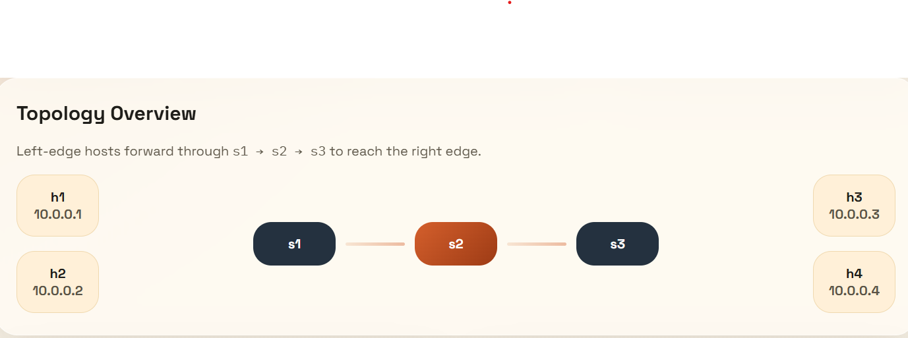

### 2. Controller Running and Installing Static Routes

This screenshot shows the controller startup and the installation of static routing rules on connected switches.

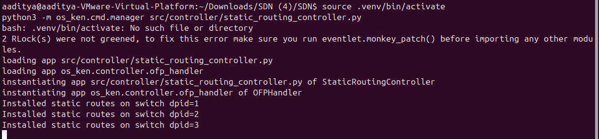

### 3. Mininet Topology Running

This screenshot shows the Mininet topology successfully launched and ready for testing.

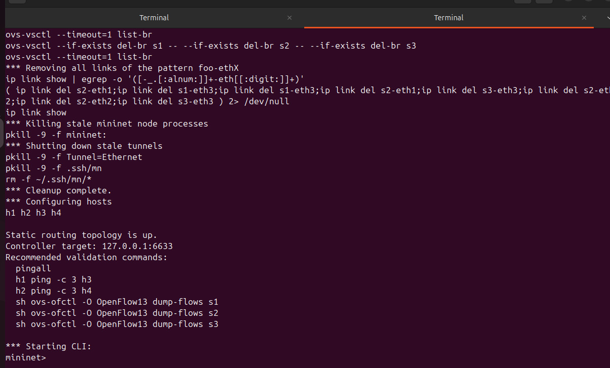

### 4. `pingall` Connectivity Validation

This screenshot verifies that all hosts can reach each other and shows successful connectivity with `0% dropped`.

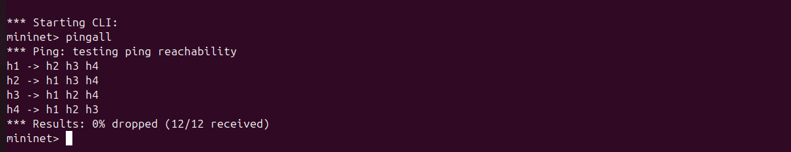

### 5. Host-to-Host Validation: `h1 -> h3`

This screenshot shows successful packet delivery from `h1` to `h3` through the predefined static path.

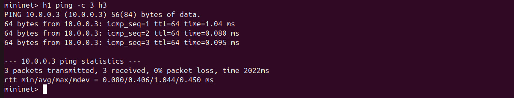

### 6. Host-to-Host Validation: `h2 -> h4`

This screenshot shows successful packet delivery from `h2` to `h4` through the predefined static path.

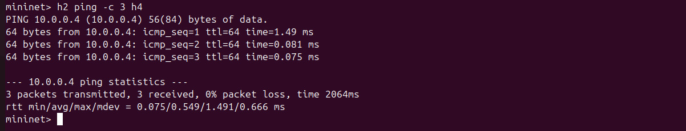

### 7. Flow Table of Switch `s1`

This screenshot shows the OpenFlow entries installed on `s1`.

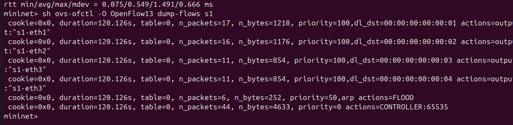

### 8. Flow Table of Switch `s2`

This screenshot shows the OpenFlow entries installed on `s2`.

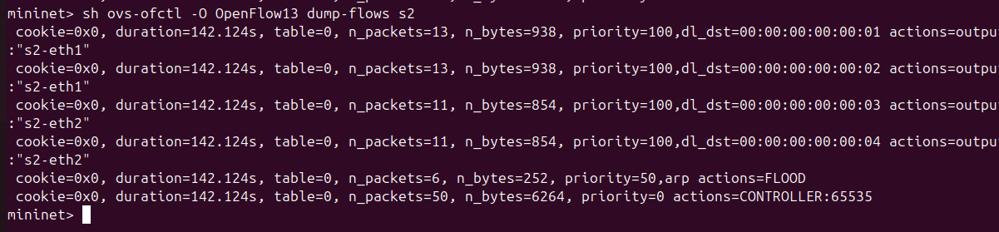

### 9. Flow Table of Switch `s3`

This screenshot shows the OpenFlow entries installed on `s3`.

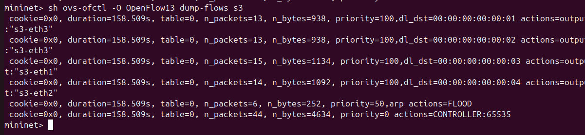

### 10. Regression Check

This screenshot shows that the route snapshot matches and confirms that the path remains unchanged after rule reinstall.

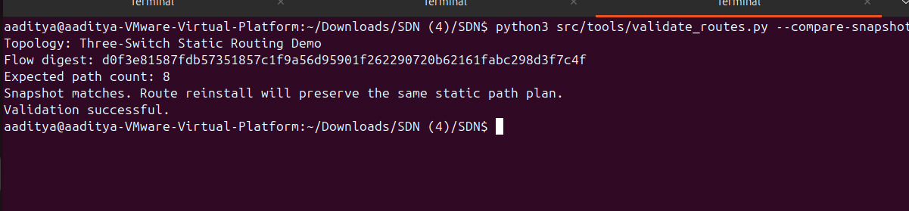

### 11. Frontend Visualization

This screenshot shows the frontend page used to visually document topology, path summary, and validation checklist.

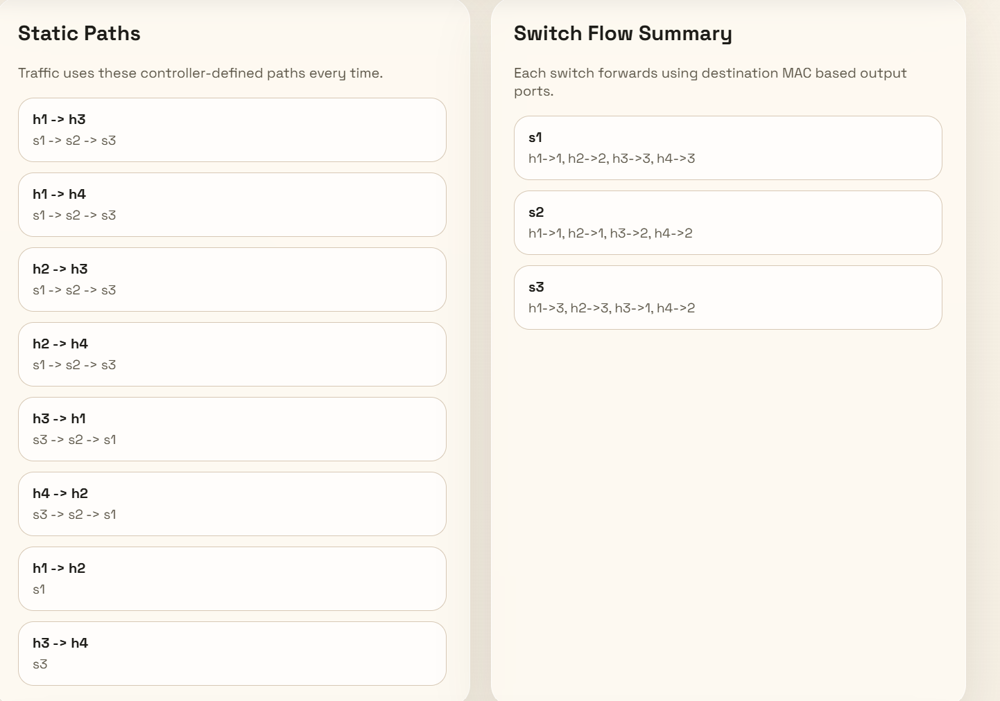

## Observation

- The controller successfully installs static rules on all switches.
- The flow tables match the predefined route configuration.
- `pingall` confirms full host connectivity.
- Host-specific ping tests validate the intended end-to-end paths.
- Flow dumps prove that forwarding is done through manually installed rules.
- Regression validation confirms that reinstalling the rules does not change the static route plan.

## Result

Static routing using an SDN controller was implemented successfully. The controller-installed OpenFlow rules enforced deterministic packet forwarding, packet delivery was validated successfully, routing behavior was documented, and regression testing confirmed path consistency after rule reinstall.

## Conclusion

This experiment demonstrates that SDN can be used to implement fixed and predictable routing through centralized controller logic. By installing explicit flow rules, the network behavior becomes deterministic, easy to validate, and simple to document. The project fully satisfies the assignment requirements for static routing using an SDN controller.

## Future Scope

- Add more hosts and switches for larger topologies
- Extend the controller to support multiple predefined routing profiles
- Add path highlighting and live metrics in the frontend
- Compare static routing with dynamic SDN routing strategies
